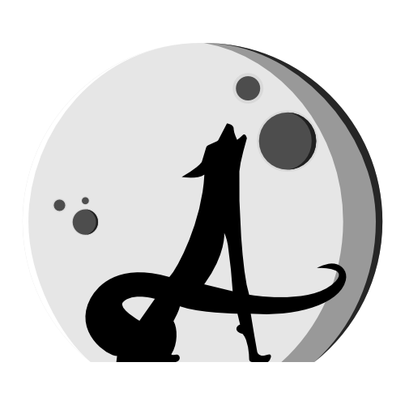
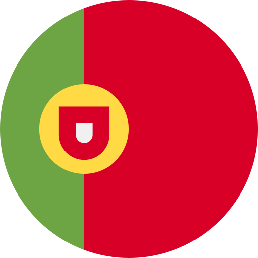

  

# Hi there 👋, I'm Amaruk

I'm a Swiss  Unity developer and a 3D artist with a passion for creating immersive experiences. Recently, I've also become an Angular developer, specializing in mobile web applications using Ionic and Capacitor.

A bit more about me: I'm a **curious** and very **kind** person. I love sharing knowledge and receiving it too! Always open to comments and feedback, as long as they’re constructive and not just “I dislike your work” (because, let’s be honest, who has time for that kind of negativity?). 😉

If you’ve got thoughts, ideas, or even better, constructive criticism, I’m all ears! And if you’ve got a good joke, I’m all laughs too. 😂

## 🌐 Languages I Speak

  
  
  

## 🔧 Technologies & Tools

### Game Development & 3D Art

### Web Development

### Design & Productivity Tools

## 🏫 Learning

I'm currently learning:  

## 📊 GitHub Stats

## 🌱 Current Projects

### HomeFlow

🔗 HomeFlow - HomeFlow is a friendly and collaborative Chore Task Manager. Each member of a **family** contributes on the chores to make their virtual garden alive!

 HomeFlow is unavailable for now. The entire app is going into a serious rethinking.

## 🌍 Connect with Me

## 🎮 Fun Facts

- 🎮 I love video games, especially story-driven games like The Legend of Zelda.
- 🎲 I'm a big fan of board games.
- 🖥️ When I'm not coding or designing, you can find me exploring new worlds in games or creating my own.
